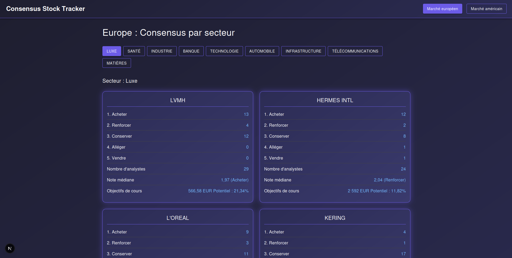
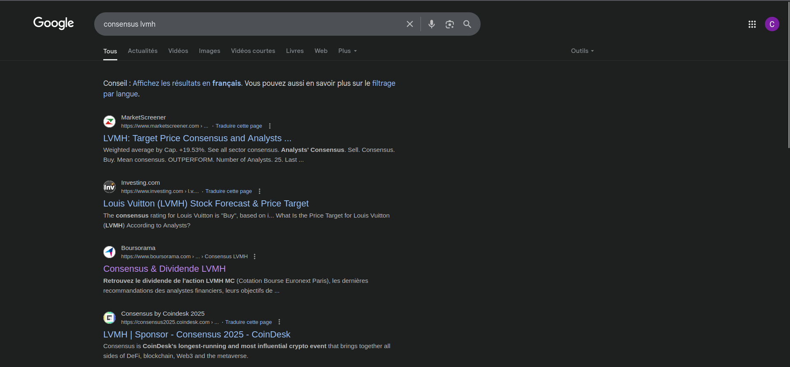
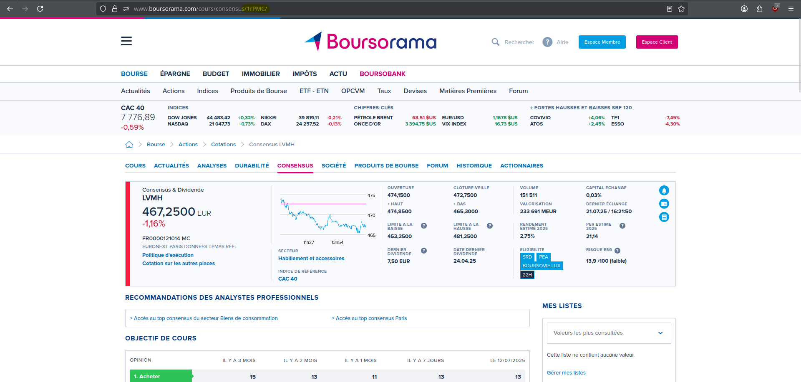
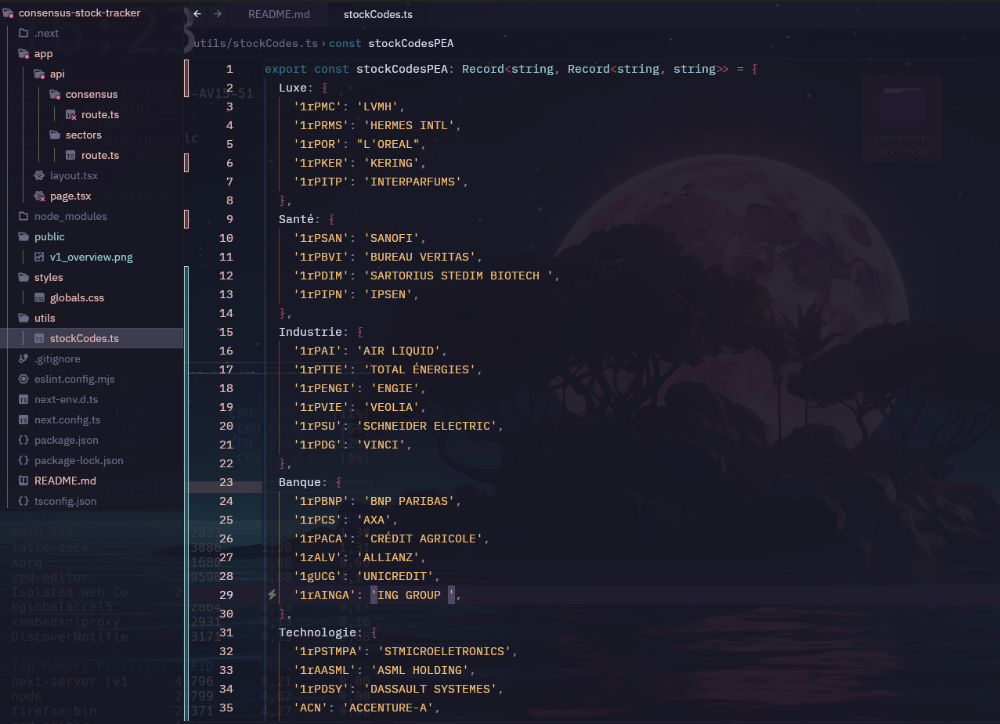

# Stock Consensus Scraper

This is a **Next.js** application that scrapes stock market consensus data from **Boursorama** and displays it by sector.

The app fetches and displays analyst consensus for various stocks, organized by sector (Luxury, Health, etc.). Users can dynamically select a sector, and the app will scrape and display relevant data for all stocks in that category.



---

## To find a stock code

First, search the internet for "boursorama consensus <stock name>"



Click on the link and select the last value of the url



Finally, add the url code with the stock name in the stockCode file in /utils



---

## 📦 Installation

```bash
npm install
# or
yarn install
```

---

## Development

Run the development server:

```bash
npm run dev
# or
yarn dev
```

Then open [http://localhost:3000](http://localhost:3000) in your browser to see the app.

---

## Available Endpoints

* `/api/sectors`: Returns the list of available sectors
* `/api/consensus?sector=Luxury`: Scrapes and returns stock consensus data for the specified sector

---

## Technologies

* [Next.js](https://nextjs.org/)
* [TypeScript](https://www.typescriptlang.org/)
* [Material UI](https://mui.com/)
* [Cheerio](https://cheerio.js.org/) for server-side scraping
